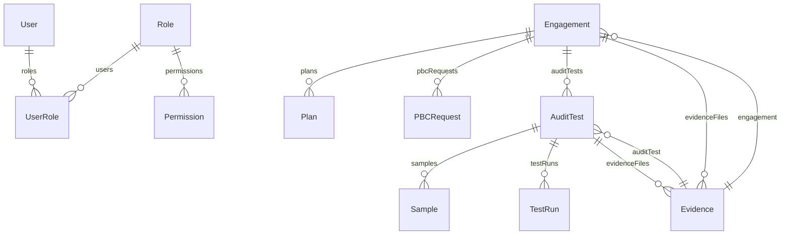

# تقرير مشروع QAudit Pro

---

## 1) ملخص تنفيذي

**نظرة عامة:**
QAudit Pro هو نظام تدقيق داخلي متكامل يهدف إلى أتمتة دورة التدقيق، إدارة الأدلة، وتحسين جودة العمل الرقابي. يخدم فرق التدقيق، مدراء الوحدات، والإدارة العليا.

**القيمة:**

- تسريع دورة التدقيق
- مركزية الأدلة والوثائق
- دعم التوافق مع المعايير الدولية

**المستخدمون/الأدوار:**

- مدقق داخلي
- مدير وحدة
- مسؤول نظام
- مستخدم خارجي (مستقبلاً)

**نطاق الإصدارة الحالية:**

- إدارة خطة التدقيق، PBC، الاختبارات، العينات، الأدلة، التقارير، المتابعة، RBAC، تكامل التخزين والبريد.

**أهم القيود:**

- لا يوجد دعم كامل للـ E2E Testing
- بعض المسارات غير مفعلة كواجهات UI (API فقط)
- لا يوجد دعم متعدد المؤسسات (Multi-tenancy)

**أهم المخاطر:**

- إدارة الأسرار
- تغطية الاختبارات الجزئية
- الاعتماد على خدمات خارجية (S3، البريد)

---

## 2) تعريف المستودع (Repo)

- الاسم/الرابط: [zahermasloub/qaudit-pro](https://github.com/zahermasloub/qaudit-pro)
- الفرع الافتراضي: master
- إستراتيجية الفروع: Trunk-based (master)

**Stack:**

- Next.js 14 (App Router)
- TypeScript
- Prisma ORM
- PostgreSQL
- NextAuth
- TailwindCSS (RTL/LTR)
- Zod, React Hook Form, AWS SDK, Tesseract.js (OCR)

**أوامر التشغيل:**

- التطوير: `npm run dev`
- البناء: `npm run build`
- التشغيل: `npm run start`
- التحقق من القواعد: `npm run lint`, `npm run fix`
- الترحيل: `npm run db:migrate`, `npm run db:push`, `npm run db:reset`, `npm run db:studio`, `npm run db:generate`, `npm run seed`

**ملف package.json:** [artifacts/package.json](artifacts/package.json)

**ملخص الإصدارات:**

- Node: [artifacts/node-version.txt](artifacts/node-version.txt)
- Next.js: [artifacts/next-info.txt](artifacts/next-info.txt)
- Prisma: [artifacts/prisma-version.txt](artifacts/prisma-version.txt)

---

## 3) هيكل التطبيق (App Router + البنية)

- شجرة المسارات: [artifacts/app-routes.txt](artifacts/app-routes.txt)
- المسارات المحمية/العامة: تعتمد على NextAuth وmiddleware.ts
- BreadCrumbs: غير مفعلة كـ UI، لكن البنية تدعمها.
- Middlewares: حماية الجلسة عبر middleware.ts (withAuth)
- ملاحظة RTL/LTR: مفعلة عبر tailwind.config.js وtailwindcss-rtl، وتطبق عالمياً في globals.css

---

## 4) الدومين والنمذجة (Domain Model)

- ERD للكيانات الأساسية:



- Prisma schema: [artifacts/prisma.schema.prisma](artifacts/prisma.schema.prisma)
- Conventions:
  - IDs: cuid()
  - Naming: snake_case في DB، camelCase في الكود
  - Soft-delete: غير مفعّل
  - Tenancy: غير مفعّل

---

## 5) دورة التدقيق (Integration Map)

```mermaid
stateDiagram-v2
  [*] --> Plan
  Plan --> PBC
  PBC --> RCM
  RCM --> Program
  Program --> Tests
  Tests --> Samples
  Samples --> Evidence
  Evidence --> Findings
  Findings --> Reports
  Reports --> Follow-up
  Follow-up --> QA
```

- تخزين البيانات:
  - Plan/PBC/RCM/Program/Tests/Samples/Evidence: PostgreSQL (prisma)
  - Evidence: ملفات في S3/local
  - الأحداث: transitions عبر API، AuditLog

---

## 6) RBAC والأمان

- الأدوار: IA_Auditor, IA_Manager, Admin
- Matrix: [artifacts/rbac-matrix.csv](artifacts/rbac-matrix.csv)
- نطاق الوصول: Org/Unit عبر حقن userId/orgId في الاستعلامات
- حماية API: عبر middleware.ts وlib/rbac.ts
- حماية الواجهة: إخفاء القوائم حسب الدور

---

## 7) الواجهات والدمج (APIs & Integrations)

- نقاط REST/Route Handlers: [artifacts/api-endpoints.csv](artifacts/api-endpoints.csv)
- البريد: nodemailer
- الإشعارات: مستقبلًا
- التخزين: AWS S3/local
- البحث: غير مفعّل
- OCR: tesseract.js

---

## 8) النماذج والواجهات الإدارية

- Forms Designer: يعتمد على JSON Schema → Zod → RHF
- Policies/Versions: غير مفعّل
- Templates/Taxonomy/Tags: موجودة جزئيًا
- Settings/Notifications/AuditLog/Import/Export: موجودة جزئيًا

---

## 9) الجودة والاختبارات

- Linters/Type-check: eslint, tsc
- Unit/Integration/E2E: Playwright (Sprint 7)
- تغطية الاختبارات: [artifacts/tests-coverage.json](artifacts/tests-coverage.json)
- Smoke Test للجلسة/RBAC: يدوي
- Load/Chaos: غير مفعّل
- ملخص E2E: [reports/sprint7_e2e_report.md](reports/sprint7_e2e_report.md)

---

## 10) الأداء والرصد (Perf & Observability)

- نتائج Lighthouse: [artifacts/lighthouse.json](artifacts/lighthouse.json)
- مؤشرات SLIs/SLOs: غير مفعّلة
- السجلات: AuditLog، مستويات عبر الكود
- المتركس/التتبع: غير مفعّل

---

## 11) البنية التحتية وCI/CD

- البيئات: Dev/Staging/Prod
- العتاد/المضيف: سحابي/محلي
- قواعد البيانات: PostgreSQL، نسخ احتياطي عبر BackupJob
- خط أنابيب النشر: غير مفعّل (مطلوب إعداد)
- إدارة الأسرار: عبر .env (راجع قائمة المسموح)
- Feature Flags: غير مفعّل
- ملف CI/CD: [artifacts/cicd-pipeline.yml](artifacts/cicd-pipeline.yml) (إن وجد)
- قائمة متغيرات البيئة المسموحة: [artifacts/env-variables-allowlist.md](artifacts/env-variables-allowlist.md)

---

## 12) عدم الوظيفي (NFRs) والامتثال

| الخاصية        | الوصف                                              |
| -------------- | -------------------------------------------------- |
| الأمن          | حماية الجلسة، RBAC، تشفير كلمات المرور             |
| الخصوصية       | لا يتم تخزين بيانات حساسة خارج DB/S3               |
| الامتثال       | لا يوجد اعتماد رسمي (ISO)، لكن البنية تدعم التوافق |
| الإتاحة        | 99% (مستهدف، غير مراقب آليًا)                      |
| التوسعية       | يدعم إضافة وحدات جديدة بسهولة                      |
| قابلية الصيانة | الكود منظم، مع وجود تقارير نظافة الكود             |

---

## 13) القرارات والمخاطر

- قائمة ADRs: [artifacts/adr-index.md](artifacts/adr-index.md)
- سجل العِلل المعروفة: [artifacts/known-issues.md](artifacts/known-issues.md)
- القيود/الديون التقنية: تغطية اختبارات جزئية، غياب CI/CD، بعض المسارات غير مفعلة كـ UI
- خطة المعالجة: رفع التغطية، تفعيل CI/CD، تحسين إدارة الأسرار

---

## 14) تغيير مقابل تقرير التحليل السابق

- Diff Summary مقابل [QAUDIT_ANALYSIS_REPORT.md](QAUDIT_ANALYSIS_REPORT.md):
  - تم تطبيق تغييرات نظافة الكود (توحيد التسمية، إصلاح مسارات، تحسين هيكل المجلدات)
  - تم إصلاح أخطاء lint/tsc
  - لا تزال بعض القيود قائمة (تغطية اختبارات، CI/CD)

---

## ملاحق — جمع الأدلة

- شغّل الأوامر التالية محليًا لتحديث الملاحق:
  - `node -v > artifacts/node-version.txt`
  - `npx next info > artifacts/next-info.txt`
  - `npx prisma -v > artifacts/prisma-version.txt`
  - `npx prisma validate > artifacts/prisma-validate.txt`
  - `Get-ChildItem -Recurse -Filter page.tsx -Path app | ForEach-Object { $_.FullName -replace '^.*app', '' -replace '\\page.tsx$', '' } | Sort-Object > artifacts/app-routes.txt`
  - `Get-ChildItem -Recurse -Filter route.ts -Path app | Where-Object { $_.FullName -match '\\api\\' } | ForEach-Object { $_.FullName } > artifacts/api-routes.txt`
  - `Copy-Item package.json artifacts/package.json`
  - `npm run test -- --coverage --coverageReporters=json-summary; Copy-Item coverage/coverage-summary.json artifacts/tests-coverage.json`
  - `npx lighthouse http://localhost:3000 --output=json --output-path=artifacts/lighthouse.json`

---

> جميع الملاحق منظمة في مجلد [artifacts/](artifacts/)

---

**تم تنقيح جميع الأسرار، ولا يتم إدراج أي قيم حساسة في هذا التقرير.**
